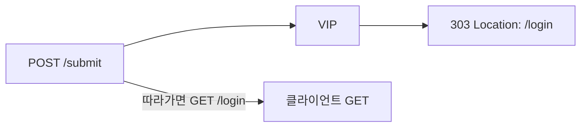

# 2.13 HTTP Redirect — statusCode 303 (POST-Redirect-GET)

## 구성



## 적용

```bash
kubectl apply -f gw-http-route.yaml
```

명령은 VIP `40.30.20.20` 에 터널로 도달하는 클라이언트에서 실행합니다.

## 클라이언트 검증

### 1. POST에 303

```bash
curl -sS -D - -o /tmp/gw-body --max-redirs 0 -X POST --data 'a=1' --resolve coffee.f5bnk.com:80:40.30.20.20 http://coffee.f5bnk.com/submit; echo; echo '--- body ---'; cat /tmp/gw-body; echo
```

**기대 응답**
- HTTP/1.1 303
- Location path 가 `/login`
- 303은 POST-Redirect-GET. 클라이언트가 Location을 GET으로 호출해야 함

### 2. 자동 추종 시 GET으로 바뀜

```bash
curl -sS -D - -o /tmp/gw-body -X POST --data 'a=1' -L --max-redirs 1 --resolve coffee.f5bnk.com:80:40.30.20.20 http://coffee.f5bnk.com/submit; echo; echo '--- body ---'; cat /tmp/gw-body; echo
```

**기대 응답**
- 첫 응답 303 후 다음 요청 method는 GET
- 이 YAML에는 /login GET rule이 없어 follow 후 404일 수 있음. 검증 포인트는 303 + Location + 추종 method=GET

## 정리

```bash
kubectl delete -f gw-http-route.yaml
```

## 참고

GW API v1.6 Extended. 303 이후 method는 GET으로 바뀌고 body는 전달하지 않습니다.
