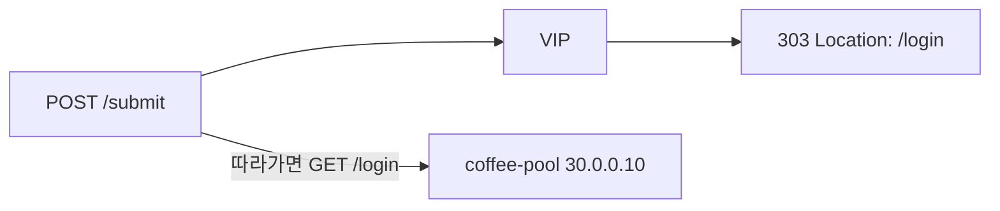

# 2.13 HTTP Redirect — statusCode 303 (POST-Redirect-GET)

## 구성



## 적용

```bash
kubectl apply -f gw-http-route.yaml
```

명령은 VIP `40.30.20.20` 에 터널로 도달하는 클라이언트에서 실행합니다.

## 클라이언트 검증

### 1. POST에 303

```bash
curl -sS -D - -o /tmp/gw-body --max-redirs 0 -X POST --data 'a=1' --resolve coffee.f5bnk.com:80:40.30.20.20 http://coffee.f5bnk.com/submit; echo; echo '--- body ---'; cat /tmp/gw-body; echo
```

**기대 응답**
- HTTP/1.1 303
- Location path 가 `/login`
- 303은 POST-Redirect-GET. 클라이언트가 Location을 GET으로 호출해야 함

### 2. 자동 추종 시 GET /login 으로 바뀜

`-D` 는 응답 헤더만 보여서 추종 후 method/URI 가 안 보입니다. `-v -L` 로 두 번째 요청 라인을 확인합니다.

```bash
curl -sS -v -L --max-redirs 1 \
  --data 'a=1' \
  --resolve coffee.f5bnk.com:80:40.30.20.20 \
  -o /dev/null \
  http://coffee.f5bnk.com/submit
```

**기대 (stderr)**

```
> POST /submit HTTP/1.1
} [3 bytes data]
< HTTP/1.0 303 See Other
< Location: http://coffee.f5bnk.com/login
* Switch to GET
> GET /login HTTP/1.0
< HTTP/1.0 200
```

- 두 번째 요청이 `GET /login` 으로 바뀜 (`* Switch to GET`)
- 두 번째 요청에는 `} [3 bytes data]` 가 없음 (body 미전달)

## 정리

```bash
kubectl delete -f gw-http-route.yaml
```

## 참고

GW API v1.6 Extended. 303 이후 method는 GET으로 바뀌고 body는 전달하지 않습니다.
