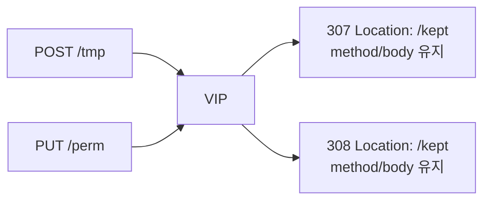

# 2.14 HTTP Redirect — statusCode 307 / 308

## 구성



## 적용

```bash
kubectl apply -f gw-http-route.yaml
```

명령은 VIP `40.30.20.20` 에 터널로 도달하는 클라이언트에서 실행합니다.

## 클라이언트 검증

### 1. 307 임시, method 유지

```bash
curl -sS -D - -o /tmp/gw-body --max-redirs 0 -X POST --data 'body=keep' --resolve coffee.f5bnk.com:80:40.30.20.20 http://coffee.f5bnk.com/tmp; echo; echo '--- body ---'; cat /tmp/gw-body; echo
```

**기대 응답**
- HTTP/1.1 307
- Location path `/kept`
- 클라이언트가 따라가면 POST + body 유지 (303과 다름)

### 2. 308 영구, method 유지

```bash
curl -sS -D - -o /tmp/gw-body --max-redirs 0 -X PUT --data 'body=keep' --resolve coffee.f5bnk.com:80:40.30.20.20 http://coffee.f5bnk.com/perm; echo; echo '--- body ---'; cat /tmp/gw-body; echo
```

**기대 응답**
- HTTP/1.1 308
- Location path `/kept`
- 따라가면 PUT + body 유지

## 정리

```bash
kubectl delete -f gw-http-route.yaml
```

## 참고

307/308은 원 요청 method와 body를 유지합니다. 303은 GET으로 바꿉니다.
