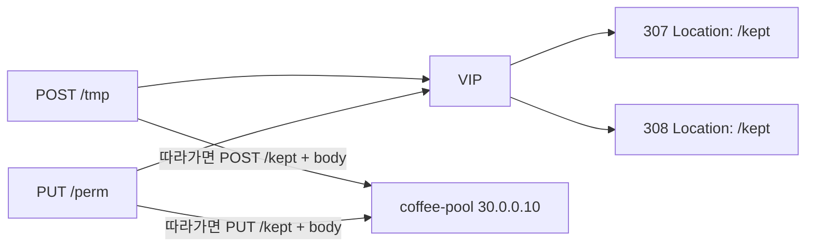

# 2.14 HTTP Redirect — statusCode 307 / 308

## 구성



## 적용

```bash
kubectl apply -f gw-http-route.yaml
```

명령은 VIP `40.30.20.20` 에 터널로 도달하는 클라이언트에서 실행합니다.

## 클라이언트 검증

`-D` + `--max-redirs 0` 은 첫 응답 헤더만 보여서, 추종 후 method/body 유지 여부를 확인할 수 없습니다.  
`-v -L` 로 두 번째 요청 라인(`> POST` / `> PUT`)을 봅니다. 303과 달리 `* Switch to GET` 이 나오면 안 됩니다.

### 1. 307 — 따라가면 POST 유지

```bash
curl -sS -v -L --max-redirs 1 \
  -X POST --data 'body=keep' \
  --resolve coffee.f5bnk.com:80:40.30.20.20 \
  -o /dev/null \
  http://coffee.f5bnk.com/tmp
```

**기대 (stderr)**

```
> POST /tmp HTTP/1.1
} [9 bytes data]
< HTTP/1.0 307
< Location: http://coffee.f5bnk.com/kept
> POST /kept HTTP/1.1
} [9 bytes data]
< HTTP/1.0 200
```

- 두 번째 요청이 `GET /kept` 가 아니라 `POST /kept`
- `} [9 bytes data]` 가 두 번 나와 body 가 다시 실림

### 2. 308 — 따라가면 PUT 유지

```bash
curl -sS -v -L --max-redirs 1 \
  -X PUT --data 'body=keep' \
  --resolve coffee.f5bnk.com:80:40.30.20.20 \
  -o /dev/null \
  http://coffee.f5bnk.com/perm
```

**기대 (stderr)**

```
> PUT /perm HTTP/1.1
} [9 bytes data]
< HTTP/1.0 308
< Location: http://coffee.f5bnk.com/kept
> PUT /kept HTTP/1.1
} [9 bytes data]
< HTTP/1.0 200
```

- 두 번째 요청이 `PUT /kept`
- body 가 다시 실림

## 정리

```bash
kubectl delete -f gw-http-route.yaml
```

## 참고

307/308은 원 요청 method와 body를 유지합니다. 303은 GET으로 바뀌고 body는 전달하지 않습니다.
