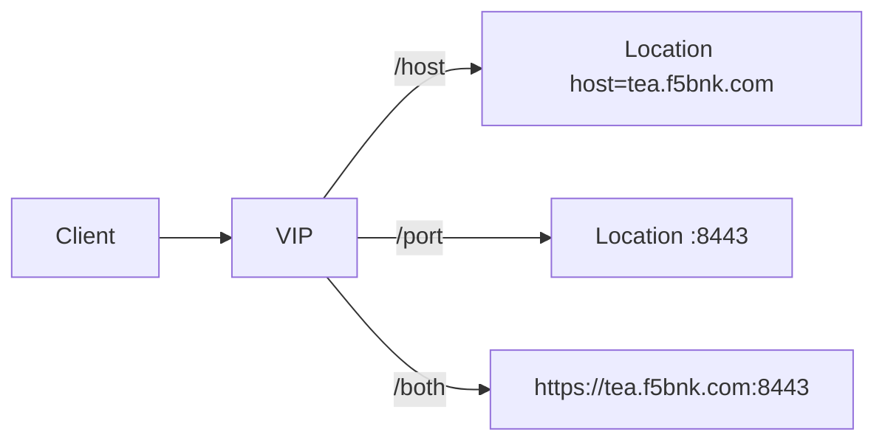

# 2.15 HTTP Redirect — hostname / port

## 구성



## 적용

```bash
kubectl apply -f gw-http-route.yaml
```

명령은 VIP `40.30.20.20` 에 터널로 도달하는 클라이언트에서 실행합니다.

## 클라이언트 검증

### 1. hostname만

```bash
curl -sS -D - -o /tmp/gw-body --max-redirs 0  --resolve coffee.f5bnk.com:80:40.30.20.20 http://coffee.f5bnk.com/host; echo; echo '--- body ---'; cat /tmp/gw-body; echo
```

**기대 응답**
- HTTP/1.1 301
- Location 호스트가 `tea.f5bnk.com`
- 기본 http/80이면 Location에 `:80` 생략

### 2. port만

```bash
curl -sS -D - -o /tmp/gw-body --max-redirs 0  --resolve coffee.f5bnk.com:80:40.30.20.20 http://coffee.f5bnk.com/port; echo; echo '--- body ---'; cat /tmp/gw-body; echo
```

**기대 응답**
- HTTP/1.1 301
- Location에 `:8443`

### 3. scheme + hostname + port

```bash
curl -sS -D - -o /tmp/gw-body --max-redirs 0  --resolve coffee.f5bnk.com:80:40.30.20.20 http://coffee.f5bnk.com/both; echo; echo '--- body ---'; cat /tmp/gw-body; echo
```

**기대 응답**
- HTTP/1.1 301
- Location이 `https://tea.f5bnk.com:8443/...`

## 정리

```bash
kubectl delete -f gw-http-route.yaml
```
