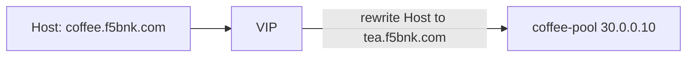

# 2.17 HTTP URL Rewrite — hostname

## 구성



## 적용

```bash
kubectl apply -f gw-http-route.yaml
```

명령은 VIP `40.30.20.20` 에 터널로 도달하는 클라이언트에서 실행합니다.

## 클라이언트 검증

### 1. 클라이언트 응답은 coffee 백엔드

```bash
curl -sS -D - -o /tmp/gw-body  -H 'Host: coffee.f5bnk.com' http://40.30.20.20/; echo; echo '--- body ---'; cat /tmp/gw-body; echo
```

**기대 응답**
- HTTP/1.1 200
- Body: `COFFEE SERVER - 30.0.0.10`
- 클라이언트 Host는 그대로. 백엔드가 받은 Host가 `tea.f5bnk.com` 이어야 함 (서버 액세스 로그 확인)

## 정리

```bash
kubectl delete -f gw-http-route.yaml
```

## 참고

Rewrite는 클라이언트 Location을 바꾸지 않습니다. 백엔드 요청 Host를 확인해야 합니다.
