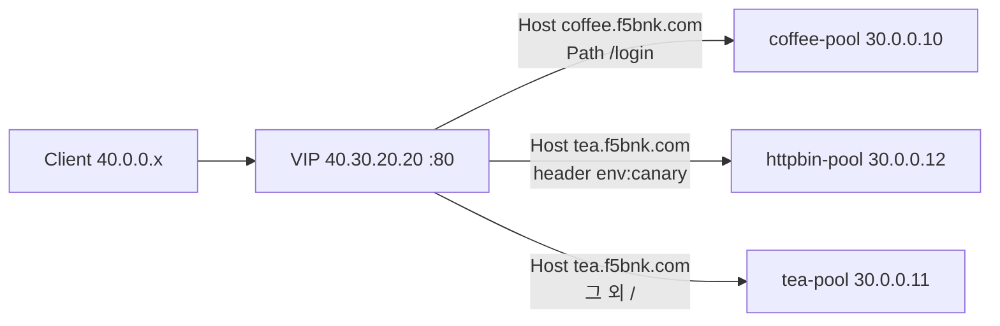

# 2.1 HTTPRoute — 기본 전달

## 구성



## 적용

```bash
kubectl apply -f gw-http-route.yaml
```

명령은 VIP `40.30.20.20` 에 터널로 도달하는 클라이언트에서 실행합니다.

Pool 헬스체크는 HTTPRoute가 아니라 `spec.monitors.http` 입니다.  
5초마다 `GET /` 을 보내고 응답에 `200` 이 있으면 멤버를 up 으로 둡니다.

```bash
kubectl get pool -n web
kubectl get pool coffee-pool -n web -o yaml
```

**기대 응답**
- Pool `READY=True` / `CR config sent to all grpc endpoints`
- `spec.monitors.http` 가 세 Pool 모두에 있음
- 백엔드가 내려가면 (예: coffee `30.0.0.10:80` 중지) 해당 Host는 500, 살아 있는 Pool은 그대로 200

## 클라이언트 검증

### 1. coffee /login

```bash
curl --resolve coffee.f5bnk.com:80:40.30.20.20 http://coffee.f5bnk.com/login
```

**기대 응답**
- HTTP/1.1 200
- Body: `COFFEE SERVER - 30.0.0.10`

### 2. coffee / 는 매칭 없음

```bash
curl --resolve coffee.f5bnk.com:80:40.30.20.20 http://coffee.f5bnk.com/
```

**기대 응답**
- HTTP/1.1 404 (Gateway에서 매칭되는 rule 없음)

### 3. tea 기본

```bash
curl --resolve tea.f5bnk.com:80:40.30.20.20 http://tea.f5bnk.com/
```

**기대 응답**
- HTTP/1.1 200
- Body: `TEA SERVER - 30.0.0.11`

### 4. tea canary 헤더

```bash
curl --resolve tea.f5bnk.com:80:40.30.20.20 -H 'env: canary' http://tea.f5bnk.com/
```

**기대 응답**
- HTTP/1.1 200
- Body: `HTTPBIN CANARY SERVER - 30.0.0.12`

## 정리

```bash
kubectl delete -f gw-http-route.yaml
```
