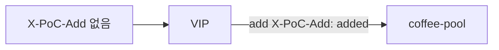

# 2.21 Request Header Modifier — add

## 구성



## 적용

```bash
kubectl apply -f gw-http-route.yaml
```

명령은 VIP `40.30.20.20` 에 터널로 도달하는 클라이언트에서 실행합니다.

## 클라이언트 검증

`add`는 헤더가 없으면 생성하고, 이미 있으면 기존 값에 새 값을 추가합니다. `set`(2.22)은 기존 값을 덮어씁니다.

백엔드 echo: `X-Echo-X-PoC-Add`

### 1. 헤더 없음 → 추가

```bash
curl -sS -D - -o /tmp/gw-body  --resolve coffee.f5bnk.com:80:40.30.20.20 http://coffee.f5bnk.com/; echo; echo '--- body ---'; cat /tmp/gw-body; echo
```

**기대 응답**
- HTTP/1.1 200
- Body: `COFFEE SERVER - 30.0.0.10`
- `X-Echo-X-PoC-Add: added`

### 2. 헤더 있음 → 기존 값에 추가

```bash
curl -sS -D - -o /tmp/gw-body -H 'X-PoC-Add: client' --resolve coffee.f5bnk.com:80:40.30.20.20 http://coffee.f5bnk.com/; echo; echo '--- body ---'; cat /tmp/gw-body; echo
```

**기대 응답**
- 백엔드 수신 헤더에 `client`와 `added`가 모두 포함되어야 함 (예: `client,added`; 공백과 복수 헤더 표현은 별도 확인)
- echo 헤더가 첫 값만 노출하면 백엔드 원본 요청 로그로 확인. `client`만 유지되거나 `added`만 남으면 실패

## 정리

```bash
kubectl delete -f gw-http-route.yaml
```

## 참고

| 옵션 | 헤더 없음 | 헤더 있음 |
|---|---|---|
| add (2.21) | 생성 | 기존 값에 새 값 추가 |
| set (2.22) | 추가 | overwrite |

공식 근거: https://gateway-api.sigs.k8s.io/reference/api-spec/main/spec/#httpheaderfilter
