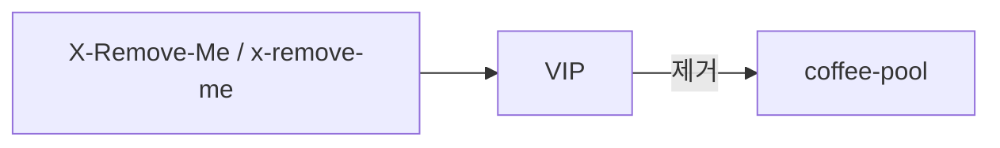

# 2.23 Request Header Modifier — remove

## 구성



## 적용

```bash
kubectl apply -f gw-http-route.yaml
```

명령은 VIP `40.30.20.20` 에 터널로 도달하는 클라이언트에서 실행합니다.

## 클라이언트 검증

### 1. 지정 헤더 제거

```bash
curl -sS -D - -o /tmp/gw-body -H 'X-Remove-Me: secret' --resolve coffee.f5bnk.com:80:40.30.20.20 http://coffee.f5bnk.com/; echo; echo '--- body ---'; cat /tmp/gw-body; echo
```

**기대 응답**
- 백엔드 요청에 `X-Remove-Me` 없음

### 2. 대소문자 다른 동일 헤더

```bash
curl -sS -D - -o /tmp/gw-body -H 'x-remove-me: secret' --resolve coffee.f5bnk.com:80:40.30.20.20 http://coffee.f5bnk.com/; echo; echo '--- body ---'; cat /tmp/gw-body; echo
```

**기대 응답**
- HTTP 헤더는 case-insensitive. 백엔드에서도 제거되어야 함

## 정리

```bash
kubectl delete -f gw-http-route.yaml
```
