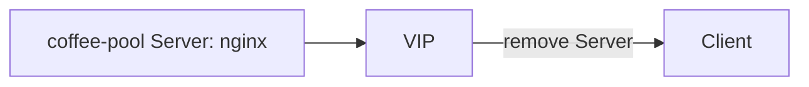

# 2.25 Response Header Modifier — remove

## 구성



## 적용

```bash
kubectl apply -f gw-http-route.yaml
```

명령은 VIP `40.30.20.20` 에 터널로 도달하는 클라이언트에서 실행합니다.

## 클라이언트 검증

### 1. 응답 Server 제거

```bash
curl -sS -D - -o /tmp/gw-body  -H 'Host: coffee.f5bnk.com' http://40.30.20.20/; echo; echo '--- body ---'; cat /tmp/gw-body; echo
```

**기대 응답**
- HTTP/1.1 200
- 응답에 `Server` 헤더가 없어야 함 (구현에 따라 hop-by-hop으로 남을 수 있음)

## 정리

```bash
kubectl delete -f gw-http-route.yaml
```
