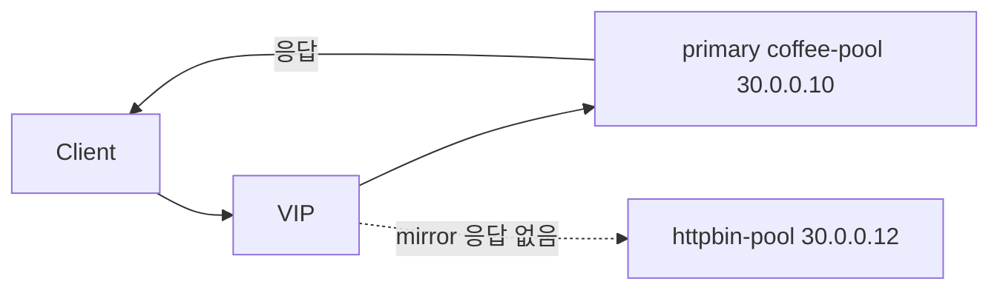

# 2.26 HTTP Request Mirror

## 구성



## 적용

```bash
kubectl apply -f gw-http-route.yaml
```

명령은 VIP `40.30.20.20` 에 터널로 도달하는 클라이언트에서 실행합니다.

## 클라이언트 검증

### 1. 클라이언트는 primary 응답만 봄

```bash
curl --resolve coffee.f5bnk.com:80:40.30.20.20 http://coffee.f5bnk.com/
```

**기대 응답**
- HTTP/1.1 200
- Body: `COFFEE SERVER - 30.0.0.10` (httpbin 응답이 아님)
- httpbin-pool 액세스 로그에도 동일 요청이 기록되어야 함

## 정리

```bash
kubectl delete -f gw-http-route.yaml
```

## 참고

Mirror는 fire-and-forget입니다. 미러 백엔드 장애가 클라이언트 응답을 바꾸면 안 됩니다.
