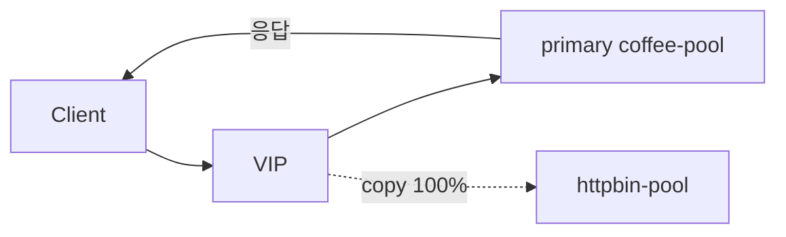

# 2.27 HTTP Request Mirror — backendRef (100%)

## 구성



## 적용

```bash
kubectl apply -f gw-http-route.yaml
```

명령은 VIP `40.30.20.20` 에 터널로 도달하는 클라이언트에서 실행합니다.

## 클라이언트 검증

### 1. 클라이언트는 primary만

```bash
curl -sS -D - -o /tmp/gw-body  --resolve coffee.f5bnk.com:80:40.30.20.20 http://coffee.f5bnk.com/; echo; echo '--- body ---'; cat /tmp/gw-body; echo
```

**기대 응답**
- HTTP/1.1 200
- Body: `COFFEE SERVER - 30.0.0.10` (httpbin 아님)
- httpbin-pool 로그에도 동일 요청

## 정리

```bash
kubectl delete -f gw-http-route.yaml
```

## 참고

mirror 응답은 client에 영향을 주지 않아야 합니다.
