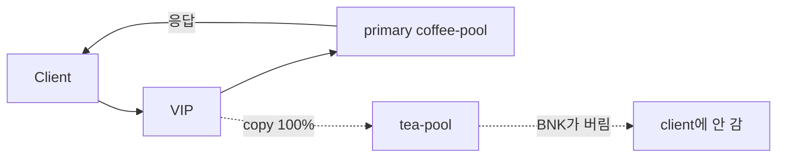

# 2.27 HTTP Request Mirror — backendRef (100%)

BNK가 요청을 coffee로 보내면서 복사본을 tea로 보낸다.  
tea가 응답해도 BNK는 그 응답을 버리고, client에는 coffee 응답만 준다.



## 적용

```bash
kubectl apply -f gw-http-route-f1.yaml
```

명령은 VIP `40.30.20.20` 에 터널로 도달하는 클라이언트에서 실행합니다.

## 클라이언트 검증

```bash
for i in $(seq 1 10); do
  curl -sS --resolve coffee.f5bnk.com:80:40.30.20.20 http://coffee.f5bnk.com/
  echo
done | sort | uniq -c
```

**기대 응답**
- 10회 모두 `COFFEE SERVER - 30.0.0.10`
- `TEA SERVER - 30.0.0.11` 0회

## 정리

```bash
kubectl delete -f gw-http-route-f1.yaml
```

## iRule 우회

네이티브 `RequestMirror` 미적용. `gw-http-route_iRule.yaml` 은 주 요청을 coffee 로 보내고, `HSL::open -proto TCP -pool web-pool-tea-pool-pool` 로 같은 `HTTP::request` 를 tea 에 복사. HSL 응답은 client 에 안 붙음. SIDEBAND `connect` 가 아니라 f5-bnk 2.17 과 같은 HSL TCP 복사.  
네이티브 YAML 과 같이 apply 하지 않는다.

```bash
kubectl apply -f gw-http-route_iRule.yaml
```

검증은 위와 동일. 10회 모두 coffee body.

```bash
kubectl delete -f gw-http-route_iRule.yaml
```
