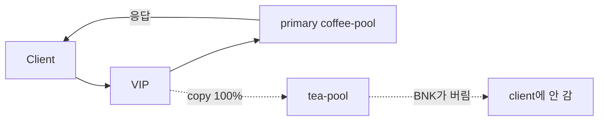

# 2.27 HTTP Request Mirror — backendRef (100%)

BNK가 요청을 coffee로 보내면서 복사본을 tea로 보낸다.  
tea가 응답해도 BNK는 그 응답을 버리고, client에는 coffee 응답만 준다.



## 적용

```bash
kubectl apply -f gw-http-route.yaml
```

명령은 VIP `40.30.20.20` 에 터널로 도달하는 클라이언트에서 실행합니다.  
tea 로그는 백엔드 호스트 `192.168.48.254` 의 `/var/log/nginx/poc-access.log` 입니다. (coffee와 같은 파일)

## 클라이언트 검증

두 가지를 같이 봐야 합니다.

1. tea가 요청을 받았는지 (mirror 전달)
2. tea 응답이 client에 안 나오는지 (BNK가 mirror 응답을 처리하지 않음)

### 1. client에는 coffee 응답만 (tea 응답은 BNK가 버림)

```bash
curl -sS -D - -o /tmp/gw-body --resolve coffee.f5bnk.com:80:40.30.20.20 http://coffee.f5bnk.com/; echo; echo '--- body ---'; cat /tmp/gw-body; echo
```

**기대 응답**
- HTTP/1.1 200
- Body: `COFFEE SERVER - 30.0.0.10`
- Body에 `TEA SERVER` 가 있으면 실패 (BNK가 tea 응답을 client로 준 것)
- tea만 주는 헤더가 client 응답에 섞이면 실패

tea는 응답해도 된다. 확인하는 것은 tea가 침묵하는지가 아니라, **그 응답을 BNK가 client에 붙이지 않는지**다.

### 2. tea가 mirror 요청을 받았는지

클라이언트에서 치기 **직전**에 백엔드에서 로그 끝을 본다.

```bash
# 192.168.48.254
wc -l /var/log/nginx/poc-access.log
tail -n 5 /var/log/nginx/poc-access.log
```

그다음 클라이언트에서 위 curl을 **1회** 하고, 다시 로그를 본다.

```bash
# 192.168.48.254
wc -l /var/log/nginx/poc-access.log
tail -n 5 /var/log/nginx/poc-access.log
```

**기대**
- 로그가 2줄 늘어남 (coffee 1 + tea 1). client 1회인데 tea 쪽이 안 늘면 mirror 미전달
- 새로 생긴 줄에 `GET /` 가 있음
- 이 로그는 tea가 요청을 **받은** 증거일 뿐, 그 응답이 client로 갔다는 뜻은 아님. client body는 1번과 같이 coffee여야 함

## 정리

```bash
kubectl delete -f gw-http-route.yaml
```
