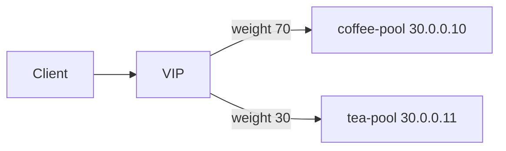

# 2.27 HTTP Traffic Splitting — weight

## 구성



## 적용

```bash
kubectl apply -f gw-http-route.yaml
```

명령은 VIP `40.30.20.20` 에 터널로 도달하는 클라이언트에서 실행합니다.

## 클라이언트 검증

### 1. 비율 확인 (20회)

```bash
for i in $(seq 1 20); do
  curl --resolve coffee.f5bnk.com:80:40.30.20.20 http://coffee.f5bnk.com/
  echo
done
```

**기대 응답**
- `COFFEE SERVER - 30.0.0.10` 가 더 많이 나와야 함 (약 70%)
- `TEA SERVER - 30.0.0.11` 는 약 30%
- 20회는 통계적으로 흔들릴 수 있음. 대략 coffee > tea 이면 통과로 봄

## 정리

```bash
kubectl delete -f gw-http-route.yaml
```
