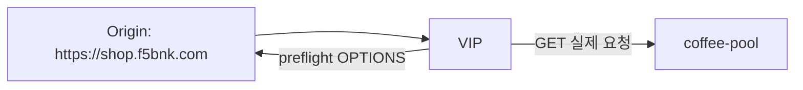

# 2.28 HTTP CORS — allowOrigins / allowMethods

## 구성



## 적용

```bash
kubectl apply -f gw-http-route.yaml
```

명령은 VIP `40.30.20.20` 에 터널로 도달하는 클라이언트에서 실행합니다.

## 클라이언트 검증

### 1. 허용 Origin preflight

```bash
curl -sS -D - -o /tmp/gw-body -X OPTIONS \
  -H 'Host: coffee.f5bnk.com' \
  -H 'Origin: https://shop.f5bnk.com' \
  -H 'Access-Control-Request-Method: POST' \
  http://40.30.20.20/; echo
```

**기대 응답**
- HTTP 200 또는 204
- `Access-Control-Allow-Origin: https://shop.f5bnk.com`
- `Access-Control-Allow-Methods` 에 GET, POST, OPTIONS

### 2. 허용 Origin GET

```bash
curl -sS -D - -o /tmp/gw-body -H 'Origin: https://shop.f5bnk.com' -H 'Host: coffee.f5bnk.com' http://40.30.20.20/; echo; echo '--- body ---'; cat /tmp/gw-body; echo
```

**기대 응답**
- HTTP/1.1 200
- Body: `COFFEE SERVER - 30.0.0.10`
- `Access-Control-Allow-Origin: https://shop.f5bnk.com`

### 3. 비허용 Origin

```bash
curl -sS -D - -o /tmp/gw-body -X OPTIONS \
  -H 'Host: coffee.f5bnk.com' \
  -H 'Origin: https://evil.example.com' \
  -H 'Access-Control-Request-Method: POST' \
  http://40.30.20.20/; echo
```

**기대 응답**
- CORS 허용 헤더가 없거나 403. `Access-Control-Allow-Origin: https://evil.example.com` 이면 실패

## 정리

```bash
kubectl delete -f gw-http-route.yaml
```
