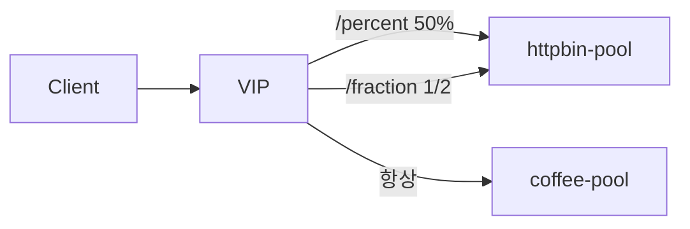

# 2.28 HTTP Request Mirror — percent / fraction

## 구성



## 적용

```bash
kubectl apply -f gw-http-route.yaml
```

명령은 VIP `40.30.20.20` 에 터널로 도달하는 클라이언트에서 실행합니다.

## 클라이언트 검증

### 1. percent 50

```bash
for i in $(seq 1 40); do
  curl -sS --resolve coffee.f5bnk.com:80:40.30.20.20 http://coffee.f5bnk.com/percent >/dev/null
done
echo '클라이언트 40회는 모두 coffee 응답. mirror 수신은 httpbin 로그에서 약 50% 확인'
```

**기대 응답**
- 클라이언트 body는 항상 `COFFEE SERVER - 30.0.0.10`
- httpbin 수신 횟수 ≈ 20회 (허용 오차)

### 2. fraction 1/2

```bash
for i in $(seq 1 40); do
  curl -sS --resolve coffee.f5bnk.com:80:40.30.20.20 http://coffee.f5bnk.com/fraction >/dev/null
done
```

**기대 응답**
- 클라이언트는 항상 coffee
- mirror 비율 약 1/2
- percent와 fraction을 같이 쓰면 fraction이 우선

## 정리

```bash
kubectl delete -f gw-http-route.yaml
```
