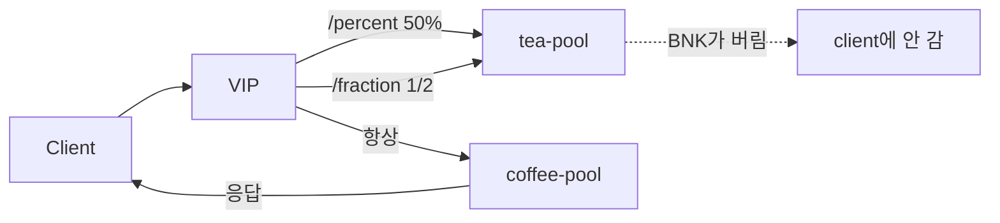

# 2.28 HTTP Request Mirror — percent / fraction

BNK가 일부 요청만 tea로 복사한다. client 응답은 항상 coffee이고, tea 응답은 BNK가 버린다.



## 적용

```bash
kubectl apply -f gw-http-route.yaml
```

명령은 VIP `40.30.20.20` 에 터널로 도달하는 클라이언트에서 실행합니다.  
tea 로그는 백엔드 호스트 `192.168.48.254` 의 `/var/log/nginx/poc-access.log` 입니다.

## 클라이언트 검증

비율 확인 전에, 2.27과 같이 **client는 coffee만** / **tea는 로그만** 을 먼저 본다.

### 1. percent 50

백엔드에서 로그 줄 수를 적어 둔다.

```bash
# 192.168.48.254
wc -l /var/log/nginx/poc-access.log
```

```bash
for i in $(seq 1 40); do
  curl -sS -o /tmp/gw-body --resolve coffee.f5bnk.com:80:40.30.20.20 http://coffee.f5bnk.com/percent
  cat /tmp/gw-body
done | grep -c 'COFFEE SERVER'
```

**기대**
- 40회 모두 body가 `COFFEE SERVER - 30.0.0.10` (`TEA SERVER` 0회)
- 백엔드 로그 증가량 ≈ 40(coffee) + 20(tea) = 약 60줄. tea 쪽이 전혀 안 늘면 mirror 미전달
- tea 응답이 client에 섞이면 실패

## 정리

```bash
kubectl delete -f gw-http-route.yaml
```

## iRule 우회

네이티브 `percent` / `fraction` 미적용. `gw-http-route_iRule.yaml` 은 `/percent`·`/fraction` 에서 `rand() < 0.5` 일 때만 2.27 과 같은 HSL 로 tea 복사.  
네이티브 YAML 과 같이 apply 하지 않는다.

```bash
kubectl apply -f gw-http-route_iRule.yaml
```

클라이언트 검증은 위와 동일. 40회 모두 coffee body, tea 로그 약 절반.

```bash
kubectl delete -f gw-http-route_iRule.yaml
```
