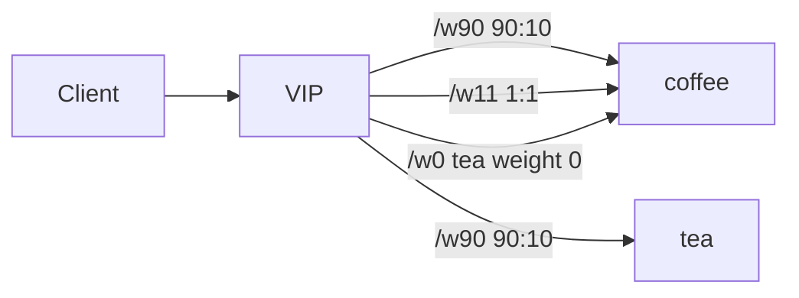

# 2.29 HTTP Traffic Splitting — backendRefs.weight

## 구성



## 적용

```bash
kubectl apply -f gw-http-route.yaml
```

명령은 VIP `40.30.20.20` 에 터널로 도달하는 클라이언트에서 실행합니다.

## 클라이언트 검증

### 1. 90/10

```bash
for i in $(seq 1 40); do
  curl -sS --resolve coffee.f5bnk.com:80:40.30.20.20 http://coffee.f5bnk.com/w90
  echo
done | sort | uniq -c
```

**기대 응답**
- `COFFEE SERVER - 30.0.0.10` 가 대부분 (약 90%)
- `TEA SERVER - 30.0.0.11` 약 10%

### 2. 1/1

```bash
for i in $(seq 1 40); do
  curl -sS --resolve coffee.f5bnk.com:80:40.30.20.20 http://coffee.f5bnk.com/w11
  echo
done | sort | uniq -c
```

**기대 응답**
- coffee/tea 가 비슷한 비율

### 3. weight=0

```bash
for i in $(seq 1 20); do
  curl -sS --resolve coffee.f5bnk.com:80:40.30.20.20 http://coffee.f5bnk.com/w0
  echo
done | sort | uniq -c
```

**기대 응답**
- 전부 `COFFEE SERVER - 30.0.0.10` (tea weight=0 은 선택 안 됨)

## 정리

```bash
kubectl delete -f gw-http-route.yaml
```
