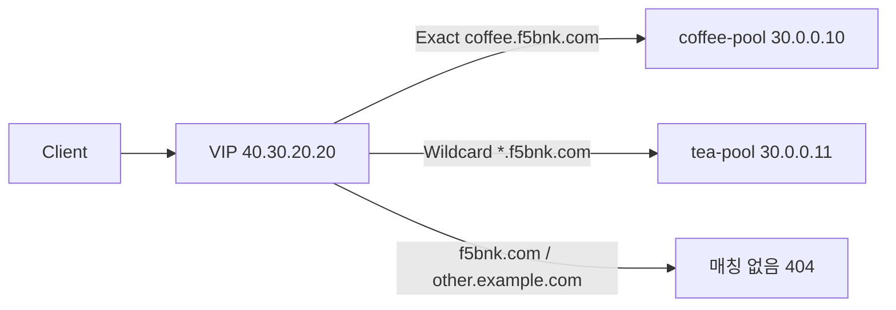

# 2.2 HTTPRoute Match — hostname Exact / Wildcard

## 구성



## 적용

```bash
kubectl apply -f gw-http-route.yaml
```

명령은 VIP `40.30.20.20` 에 터널로 도달하는 클라이언트에서 실행합니다.

## 클라이언트 검증

### 1. Exact

```bash
curl --resolve coffee.f5bnk.com:80:40.30.20.20 http://coffee.f5bnk.com/
```

**기대 응답**
- HTTP/1.1 200
- Body: `COFFEE SERVER - 30.0.0.10`
- Wildcard보다 Exact가 우선

### 2. Wildcard 한 라벨

```bash
curl --resolve shop.f5bnk.com:80:40.30.20.20 http://shop.f5bnk.com/
```

**기대 응답**
- HTTP/1.1 200
- Body: `TEA SERVER - 30.0.0.11`

### 3. Wildcard 여러 라벨

```bash
curl --resolve a.b.f5bnk.com:80:40.30.20.20 http://a.b.f5bnk.com/
```

**기대 응답**
- HTTP/1.1 200
- Body: `TEA SERVER - 30.0.0.11`

### 4. apex는 wildcard 미매칭

```bash
curl --resolve f5bnk.com:80:40.30.20.20 http://f5bnk.com/
```

**기대 응답**
- HTTP/1.1 404

### 5. 다른 도메인

```bash
curl --resolve other.example.com:80:40.30.20.20 http://other.example.com/
```

**기대 응답**
- HTTP/1.1 404

## 정리

```bash
kubectl delete -f gw-http-route.yaml
```

## 참고

GW API v1.6: `*.f5bnk.com` 은 suffix 매칭. apex `f5bnk.com` 은 매칭하지 않음. regex 없음.
