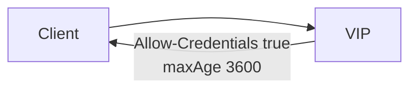

# 2.30 HTTP CORS — maxAge / allowCredentials

## 구성



## 적용

```bash
kubectl apply -f gw-http-route.yaml
```

명령은 VIP `40.30.20.20` 에 터널로 도달하는 클라이언트에서 실행합니다.

## 클라이언트 검증

### 1. credentials + maxAge

```bash
curl -sS -D - -o /tmp/gw-body -X OPTIONS \
  -H 'Host: coffee.f5bnk.com' \
  -H 'Origin: https://shop.f5bnk.com' \
  -H 'Access-Control-Request-Method: GET' \
  http://40.30.20.20/; echo
```

**기대 응답**
- `Access-Control-Allow-Credentials: true`
- `Access-Control-Max-Age: 3600`
- `Access-Control-Allow-Origin` 이 `*` 가 아니라 `https://shop.f5bnk.com` (credentials와 * 동시 사용 불가)

## 정리

```bash
kubectl delete -f gw-http-route.yaml
```
