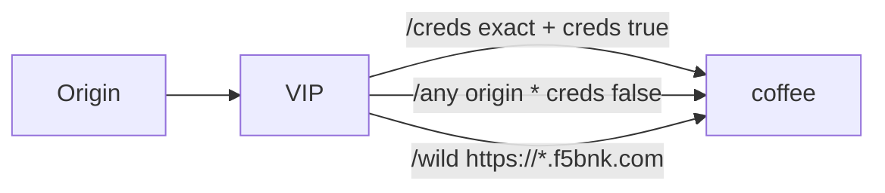

# 2.30 HTTP CORS — allowOrigins / allowCredentials

Origin은 `https://host`, `https://*.host`(왼쪽 greedy), 또는 단독 `"*"`.  
`"*"` 는 다른 origin과 같이 못 씀. `allowCredentials: true` 이면 `Access-Control-Allow-Origin` 이 `*` 이면 안 됨.

CORS는 매칭 Origin에 헤더를 붙이는 필터다. 비매칭 Origin도 요청은 backend로 가고, ACAO만 빠진다.



## 적용

```bash
kubectl apply -f gw-http-route.yaml
```

명령은 VIP `40.30.20.20` 에 터널로 도달하는 클라이언트에서 실행합니다.

## 클라이언트 검증

### 1. Exact origin + credentials true

```bash
curl -sS -D - -o /tmp/gw-body -H 'Origin: https://shop.f5bnk.com' --resolve coffee.f5bnk.com:80:40.30.20.20 http://coffee.f5bnk.com/creds; echo; echo '--- body ---'; cat /tmp/gw-body; echo
```

**기대 응답**
- HTTP/1.1 200
- Body: `COFFEE SERVER - 30.0.0.10`
- `Access-Control-Allow-Origin: https://shop.f5bnk.com` (요청 Origin echo, `*` 이면 실패)
- `Access-Control-Allow-Credentials: true`

### 2. 비허용 Origin

```bash
curl -sS -D - -o /tmp/gw-body -H 'Origin: https://evil.example.com' --resolve coffee.f5bnk.com:80:40.30.20.20 http://coffee.f5bnk.com/creds; echo; echo '--- body ---'; cat /tmp/gw-body; echo
```

**기대 응답**
- HTTP/1.1 200 (요청은 막지 않음)
- Body: `COFFEE SERVER - 30.0.0.10`
- `Access-Control-Allow-Origin` 없음 (`https://evil.example.com` echo 이면 실패)

### 3. allowOrigins `*` + credentials false

```bash
curl -sS -D - -o /tmp/gw-body -H 'Origin: https://foo.example' --resolve coffee.f5bnk.com:80:40.30.20.20 http://coffee.f5bnk.com/any; echo; echo '--- body ---'; cat /tmp/gw-body; echo
```

**기대 응답**
- `Access-Control-Allow-Origin` 가 `*` 이거나 요청 Origin echo
- `Access-Control-Allow-Credentials` 헤더 없음 (`true` 이면 실패)

### 4. hostname wildcard `https://*.f5bnk.com`

`*` 는 왼쪽 greedy(여러 라벨·`.` 포함). 헤더에는 `*` 가 나가지 않고 요청 Origin을 echo.

```bash
curl -sS -D - -o /tmp/gw-body -H 'Origin: https://a.f5bnk.com' --resolve coffee.f5bnk.com:80:40.30.20.20 http://coffee.f5bnk.com/wild; echo; echo '--- body ---'; cat /tmp/gw-body; echo
curl -sS -D - -o /tmp/gw-body -H 'Origin: https://x.y.f5bnk.com' --resolve coffee.f5bnk.com:80:40.30.20.20 http://coffee.f5bnk.com/wild; echo; echo '--- body ---'; cat /tmp/gw-body; echo
curl -sS -D - -o /tmp/gw-body -H 'Origin: https://evil.example.com' --resolve coffee.f5bnk.com:80:40.30.20.20 http://coffee.f5bnk.com/wild; echo; echo '--- body ---'; cat /tmp/gw-body; echo
```

**기대 응답**
- `https://a.f5bnk.com` → `Access-Control-Allow-Origin: https://a.f5bnk.com`
- `https://x.y.f5bnk.com` → `Access-Control-Allow-Origin: https://x.y.f5bnk.com`
- `https://evil.example.com` → `Access-Control-Allow-Origin` 없음

## 정리

```bash
kubectl delete -f gw-http-route.yaml
```
