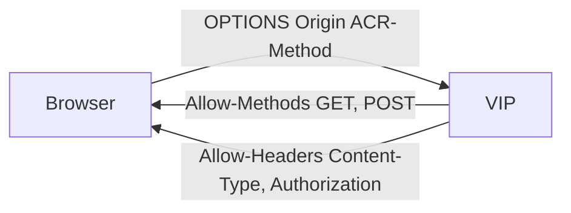

# 2.31 HTTP CORS — allowMethods / allowHeaders

preflight(`OPTIONS` + `Origin` + `Access-Control-Request-Method`)에 YAML 목록을 그대로 찍는다.



## 적용

```bash
kubectl apply -f gw-http-route-f1.yaml
```

명령은 VIP `40.30.20.20` 에 터널로 도달하는 클라이언트에서 실행합니다.

## 클라이언트 검증

```bash
curl -sS -D - -o /tmp/gw-body -X OPTIONS \
  -H 'Origin: https://shop.f5bnk.com' \
  -H 'Access-Control-Request-Method: POST' \
  -H 'Access-Control-Request-Headers: Content-Type, Authorization' \
  --resolve coffee.f5bnk.com:80:40.30.20.20 http://coffee.f5bnk.com/; echo; echo '--- body ---'; cat /tmp/gw-body; echo
```

**기대 응답**
- 200 또는 204
- Body 에 `COFFEE SERVER` 없음
- `Access-Control-Allow-Origin: https://shop.f5bnk.com`
- `Access-Control-Allow-Methods: GET, POST`
- `Access-Control-Allow-Headers: Content-Type, Authorization`

## 정리

```bash
kubectl delete -f gw-http-route-f1.yaml
```

## iRule 우회

네이티브 `type: CORS` 미적용. `gw-http-route_iRule.yaml` 은 preflight 에 YAML 목록을 찍고 204.  
네이티브 YAML 과 같이 apply 하지 않는다.

```bash
kubectl apply -f gw-http-route_iRule.yaml
```

클라이언트 검증 명령·기대 응답은 위와 동일.

```bash
kubectl delete -f gw-http-route_iRule.yaml
```
