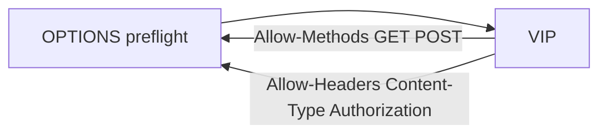

# 2.31 HTTP CORS — allowMethods / allowHeaders

preflight(`OPTIONS` + `Origin` + `Access-Control-Request-Method`)에서  
`Access-Control-Allow-Methods` / `Access-Control-Allow-Headers` 가 YAML 목록과 같은지 본다.

목록에 없는 method·header는 **게이트웨이가 403으로 막지 않는다**. 응답 Allow 목록에 안 들어가고, 브라우저가 CORS를 실패한다.  
Allow 헤더 값의 순서·공백은 구현체마다 다를 수 있다.



## 적용

```bash
kubectl apply -f gw-http-route.yaml
```

명령은 VIP `40.30.20.20` 에 터널로 도달하는 클라이언트에서 실행합니다.

## 클라이언트 검증

### 1. 허용 method / header preflight

```bash
curl -sS -D - -o /tmp/gw-body -X OPTIONS \
  -H 'Origin: https://shop.f5bnk.com' \
  -H 'Access-Control-Request-Method: POST' \
  -H 'Access-Control-Request-Headers: Content-Type, Authorization' \
  --resolve coffee.f5bnk.com:80:40.30.20.20 http://coffee.f5bnk.com/; echo; echo '--- body ---'; cat /tmp/gw-body; echo
```

**기대 응답**
- 200 또는 204 (preflight는 Gateway가 바로 응답할 수 있음)
- `Access-Control-Allow-Origin: https://shop.f5bnk.com`
- `Access-Control-Allow-Methods` 에 GET, POST
- `Access-Control-Allow-Headers` 에 Content-Type, Authorization

### 2. 목록에 없는 method

```bash
curl -sS -D - -o /tmp/gw-body -X OPTIONS \
  -H 'Origin: https://shop.f5bnk.com' \
  -H 'Access-Control-Request-Method: DELETE' \
  --resolve coffee.f5bnk.com:80:40.30.20.20 http://coffee.f5bnk.com/; echo; echo '--- body ---'; cat /tmp/gw-body; echo
```

**기대 응답**
- 200 또는 204 (Origin은 매칭되므로 CORS 헤더는 내려감)
- `Access-Control-Allow-Methods` 에 GET, POST 있고 DELETE 없음
- `Access-Control-Allow-Origin: https://shop.f5bnk.com`

### 3. 목록에 없는 request header

```bash
curl -sS -D - -o /tmp/gw-body -X OPTIONS \
  -H 'Origin: https://shop.f5bnk.com' \
  -H 'Access-Control-Request-Method: POST' \
  -H 'Access-Control-Request-Headers: X-Not-Allowed' \
  --resolve coffee.f5bnk.com:80:40.30.20.20 http://coffee.f5bnk.com/; echo; echo '--- body ---'; cat /tmp/gw-body; echo
```

**기대 응답**
- 200 또는 204
- `Access-Control-Allow-Headers` 에 Content-Type, Authorization 있고 `X-Not-Allowed` 없음

## 정리

```bash
kubectl delete -f gw-http-route.yaml
```
