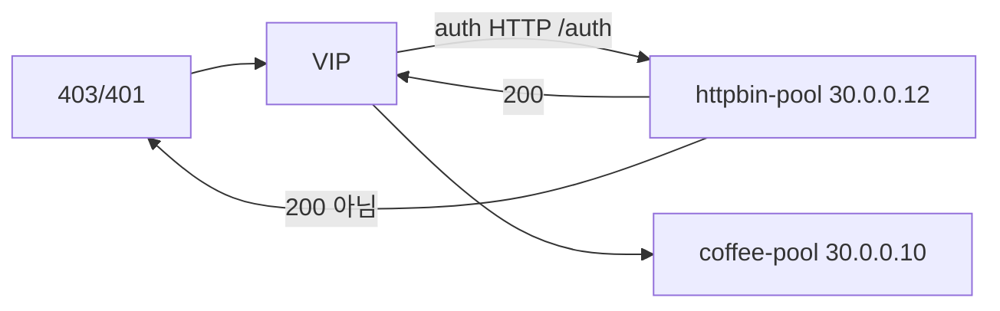

# 2.31 HTTP External Auth — HTTP

## 구성



## 적용

```bash
kubectl apply -f gw-http-route.yaml
```

명령은 VIP `40.30.20.20` 에 터널로 도달하는 클라이언트에서 실행합니다.

## 클라이언트 검증

### 1. auth 성공 시 백엔드 전달

```bash
curl -sS -D - -o /tmp/gw-body  -H 'Host: coffee.f5bnk.com' http://40.30.20.20/; echo; echo '--- body ---'; cat /tmp/gw-body; echo
```

**기대 응답**
- auth 서버가 200을 주면 HTTP 200 + `{COFFEE}`
- auth 서버가 200이 아니면 4xx/5xx, coffee로 안 감
- 현재 httpbin-pool `/auth` 구현에 따라 결과가 갈림

## 정리

```bash
kubectl delete -f gw-http-route.yaml
```

## 참고

GW API: HTTP auth 백엔드는 성공 시 200. 그 외는 실패(fail closed).
