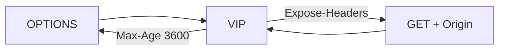

# 2.32 HTTP CORS — exposeHeaders / maxAge

`maxAge` 는 preflight 캐시 초 → `Access-Control-Max-Age`. 실제 GET에는 안 붙는다.  
`exposeHeaders` 는 실제 CORS 응답에서 JS가 읽을 헤더 → `Access-Control-Expose-Headers`.  
coffee가 내려주는 `X-Request-Id` / `X-Echo-Host` 를 목록에 넣었다.



## 적용

```bash
kubectl apply -f gw-http-route.yaml
```

명령은 VIP `40.30.20.20` 에 터널로 도달하는 클라이언트에서 실행합니다.

## 클라이언트 검증

### 1. preflight maxAge

```bash
curl -sS -D - -o /tmp/gw-body -X OPTIONS \
  -H 'Origin: https://shop.f5bnk.com' \
  -H 'Access-Control-Request-Method: GET' \
  --resolve coffee.f5bnk.com:80:40.30.20.20 http://coffee.f5bnk.com/; echo; echo '--- body ---'; cat /tmp/gw-body; echo
```

**기대 응답**
- 200 또는 204
- `Access-Control-Allow-Origin: https://shop.f5bnk.com`
- `Access-Control-Max-Age: 3600`

### 2. 실제 요청 exposeHeaders

```bash
curl -sS -D - -o /tmp/gw-body -H 'Origin: https://shop.f5bnk.com' --resolve coffee.f5bnk.com:80:40.30.20.20 http://coffee.f5bnk.com/; echo; echo '--- body ---'; cat /tmp/gw-body; echo
```

**기대 응답**
- HTTP/1.1 200
- Body: `COFFEE SERVER - 30.0.0.10`
- `Access-Control-Allow-Origin: https://shop.f5bnk.com`
- `Access-Control-Expose-Headers` 에 `X-Request-Id`, `X-Echo-Host`
- `Access-Control-Max-Age` 없음 (preflight 전용)

## 정리

```bash
kubectl delete -f gw-http-route.yaml
```
