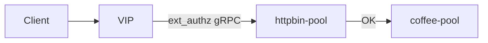

# 2.32 HTTP External Auth — gRPC

## 구성



## 적용

```bash
kubectl apply -f gw-http-route.yaml
```

명령은 VIP `40.30.20.20` 에 터널로 도달하는 클라이언트에서 실행합니다.

## 클라이언트 검증

### 1. gRPC auth 경로

```bash
curl -sS -D - -o /tmp/gw-body  -H 'Host: coffee.f5bnk.com' http://40.30.20.20/; echo; echo '--- body ---'; cat /tmp/gw-body; echo
```

**기대 응답**
- auth 서버가 Envoy ext_authz OK 이면 200 + coffee body
- 프로토콜 불일치면 fail closed (보통 403/5xx)

## 정리

```bash
kubectl delete -f gw-http-route.yaml
```

## 참고

auth 백엔드는 Envoy ext_authz gRPC를 말해야 합니다. 현재 pool member가 gRPC auth가 아니면 실패가 정상입니다.
