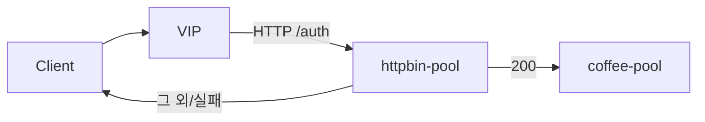

# 2.33 HTTP External Auth — protocol HTTP

## 구성



## 적용

```bash
kubectl apply -f gw-http-route.yaml
```

명령은 VIP `40.30.20.20` 에 터널로 도달하는 클라이언트에서 실행합니다.

## 클라이언트 검증

### 1. auth 결과에 따른 전달

```bash
curl -sS -D - -o /tmp/gw-body  --resolve coffee.f5bnk.com:80:40.30.20.20 http://coffee.f5bnk.com/; echo; echo '--- body ---'; cat /tmp/gw-body; echo
```

**기대 응답**
- auth 200이면 200 + coffee body
- 200 아님·연결 실패는 fail-close (4xx/5xx), coffee로 안 감

## 정리

```bash
kubectl delete -f gw-http-route.yaml
```

iRule로는 불가. 전달 전 인증 서버(`httpbin-pool` `/auth`)에 **별도 HTTP 라운드트립**을 한 뒤 200만 coffee로 보내야 한다. 이 TMM에서 검증된 iRule은 현재 연결의 `HTTP_REQUEST`/`HTTP_RESPONSE`(헤더·retry·after)뿐이고, SIDEBAND `connect`/`recv` 로 인증 서버를 호출한 적이 없다.
