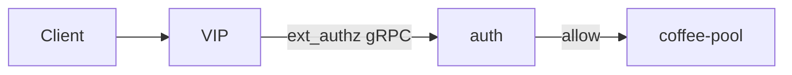

# 2.34 HTTP External Auth — protocol GRPC

## 구성



## 적용

```bash
kubectl apply -f gw-http-route.yaml
```

명령은 VIP `40.30.20.20` 에 터널로 도달하는 클라이언트에서 실행합니다.

## 클라이언트 검증

### 1. gRPC auth

```bash
curl -sS -D - -o /tmp/gw-body  --resolve coffee.f5bnk.com:80:40.30.20.20 http://coffee.f5bnk.com/; echo; echo '--- body ---'; cat /tmp/gw-body; echo
```

**기대 응답**
- allow면 coffee 200
- deny/error/프로토콜 불일치는 fail-close

## 정리

```bash
kubectl delete -f gw-http-route.yaml
```

## 참고

auth 백엔드는 Envoy ext_authz gRPC를 말해야 합니다.
