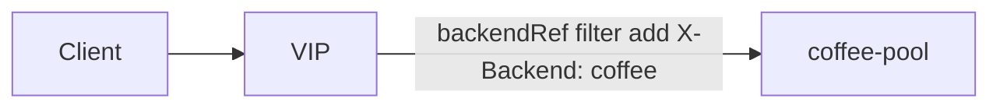

# 2.35 HTTP BackendRef — filters

## 구성



## 적용

```bash
kubectl apply -f gw-http-route.yaml
```

명령은 VIP `40.30.20.20` 에 터널로 도달하는 클라이언트에서 실행합니다.

## 클라이언트 검증

### 1. backendRef 단위 헤더 추가

```bash
curl --resolve coffee.f5bnk.com:80:40.30.20.20 http://coffee.f5bnk.com/
```

**기대 응답**
- HTTP/1.1 200
- Body: `COFFEE SERVER - 30.0.0.10`
- 백엔드 요청에 `X-Backend: coffee`

## 정리

```bash
kubectl delete -f gw-http-route.yaml
```
