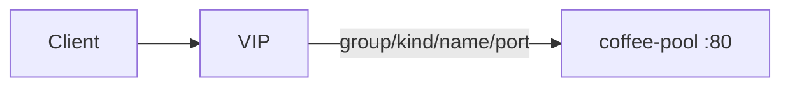

# 2.35 HTTP BackendRef — Service / port

## 구성



## 적용

```bash
kubectl apply -f gw-http-route.yaml
```

명령은 VIP `40.30.20.20` 에 터널로 도달하는 클라이언트에서 실행합니다.

## 클라이언트 검증

### 1. 정상 port 전달

```bash
curl -sS -D - -o /tmp/gw-body  --resolve coffee.f5bnk.com:80:40.30.20.20 http://coffee.f5bnk.com/; echo; echo '--- body ---'; cat /tmp/gw-body; echo
```

**기대 응답**
- HTTP/1.1 200
- Body: `COFFEE SERVER - 30.0.0.10`
- ResolvedRefs=True

### 2. 없는 backend

```bash
kubectl get httproute backendref-port-route -n web -o jsonpath='{.status.parents[0].conditions}' ; echo
```

**기대 응답**
- 존재하지 않는 name으로 바꾸면 5xx, ResolvedRefs=False

## 정리

```bash
kubectl delete -f gw-http-route.yaml
```

## 참고

이 PoC는 외부 클러스터 Pool(`k8s.f5net.com`)을 Service 자리에 사용합니다.
