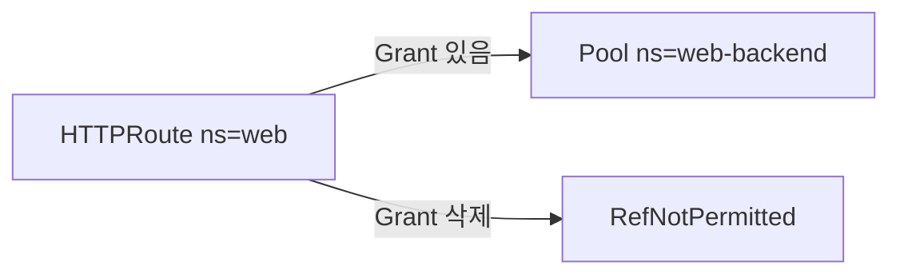

# 2.36 HTTP BackendRef — namespace / ReferenceGrant

## 구성



## 사전 준비

YAML이 `web-backend` Namespace를 포함합니다.

## 적용

```bash
kubectl apply -f gw-http-route.yaml
```

명령은 VIP `40.30.20.20` 에 터널로 도달하는 클라이언트에서 실행합니다.

## 클라이언트 검증

### 1. Grant 적용 후 전달

```bash
curl -sS -D - -o /tmp/gw-body  --resolve coffee.f5bnk.com:80:40.30.20.20 http://coffee.f5bnk.com/; echo; echo '--- body ---'; cat /tmp/gw-body; echo
```

**기대 응답**
- HTTP/1.1 200
- Body: `COFFEE SERVER - 30.0.0.10`
- ResolvedRefs=True

### 2. Grant 삭제 시

```bash
kubectl delete referencegrant allow-web-to-pool -n web-backend; kubectl get httproute backendref-grant-route -n web
```

**기대 응답**
- ResolvedRefs=False, reason RefNotPermitted
- 트래픽 실패

## 정리

```bash
kubectl delete -f gw-http-route.yaml
```
