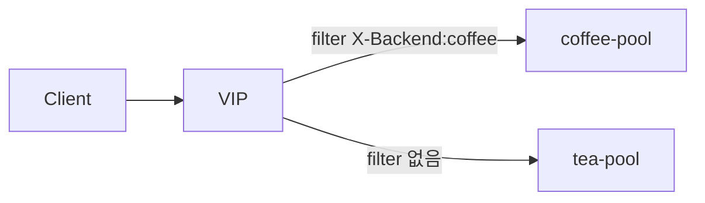

# 2.37 HTTP BackendRef — backendRef.filters

## 구성



## 적용

```bash
kubectl apply -f gw-http-route.yaml
```

명령은 VIP `40.30.20.20` 에 터널로 도달하는 클라이언트에서 실행합니다.

## 클라이언트 검증

### 1. 지정 backend에만 filter

```bash
for i in $(seq 1 10); do
  curl -sS --resolve coffee.f5bnk.com:80:40.30.20.20 http://coffee.f5bnk.com/
  echo
done
```

**기대 응답**
- coffee로 간 요청만 백엔드에 `X-Backend: coffee` (`X-Echo-X-Backend: coffee`)
- tea로 간 요청에는 해당 헤더 없음

Native `backendRef.filters` 는 Accepted 이지만 지정 backend에만 헤더가 안 붙는다.  
카탈로그 2.9 경로분기 header iRule만 사용 (`/coffee` → `X-Backend: coffee`). per-backendRef 는 불가.

## 정리

```bash
kubectl delete -f gw-http-route.yaml
```
