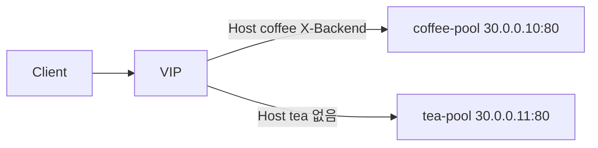

# 2.37 HTTP BackendRef — backendRef.filters

## 구성



## 적용

```bash
kubectl apply -f gw-http-route-f1.yaml
```

명령은 VIP `40.30.20.20` 에 터널로 도달하는 클라이언트에서 실행합니다.

## 클라이언트 검증

백엔드가 요청 `X-Backend` 를 `X-Echo-X-Backend` 로 찍어 준다.

```bash
curl -sS -D - -o /tmp/gw-body --resolve coffee.f5bnk.com:80:40.30.20.20 http://coffee.f5bnk.com/
echo; echo '--- body ---'; cat /tmp/gw-body; echo
curl -sS -D - -o /tmp/gw-body --resolve tea.f5bnk.com:80:40.30.20.20 http://tea.f5bnk.com/
echo; echo '--- body ---'; cat /tmp/gw-body; echo
```

**기대 응답**
- Host coffee → 200 `COFFEE SERVER - 30.0.0.10`, `X-Echo-X-Backend: coffee`
- Host tea → 200 `TEA SERVER - 30.0.0.11`, `X-Echo-X-Backend` 없음

## 정리

```bash
kubectl delete -f gw-http-route-f1.yaml
```

## iRule 우회

네이티브 `backendRef.filters` 는 Accepted 이지만 지정 backend에만 헤더가 안 붙는다.  
backend 는 **Host** 로 나눈다. IP 만 보면 동일 IP + 다른 port 를 구분하지 못한다.  
`HTTP_REQUEST` 에서 Host `coffee.f5bnk.com` 이면 `X-Backend: coffee`. `LB_SELECTED` 는 요청 시점이 아님.  
네이티브 YAML 과 같이 apply 하지 않는다.

```bash
kubectl apply -f gw-http-route_iRule.yaml
```

검증 명령은 위와 동일.

**기대 응답**
- Host coffee → 200 `COFFEE SERVER - 30.0.0.10`, `X-Echo-X-Backend: coffee`
- Host tea → 200 `TEA SERVER - 30.0.0.11`, `X-Echo-X-Backend` 없음

```bash
kubectl delete -f gw-http-route_iRule.yaml
```
