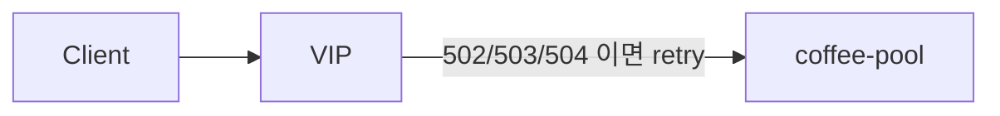

# 2.38 HTTP Retries — codes

## 구성



## 적용

```bash
kubectl apply -f gw-http-route.yaml
```

명령은 VIP `40.30.20.20` 에 터널로 도달하는 클라이언트에서 실행합니다.

## 클라이언트 검증

### 1. 정상 시 retry 없음

```bash
curl --resolve coffee.f5bnk.com:80:40.30.20.20 http://coffee.f5bnk.com/
```

**기대 응답**
- HTTP/1.1 200
- Body: `COFFEE SERVER - 30.0.0.10`

### 2. 재시도 대상 코드

```bash
echo '백엔드가 503을 주면 Gateway가 같은 pool에 재시도 후 최종 응답'
```

**기대 응답**
- 502/503/504 에서 retry. 백엔드 로그에 동일 요청이 여러 번 보여야 함

## 정리

```bash
kubectl delete -f gw-http-route.yaml
```
