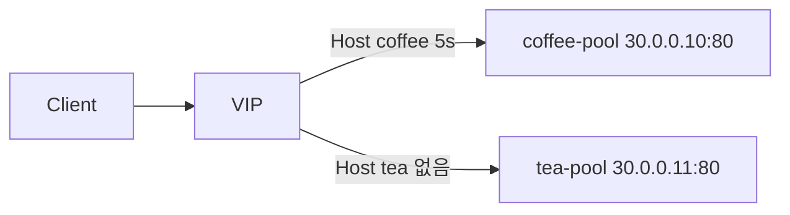

# 2.39 HTTP Timeouts — backendRequest

## 구성



## 적용

```bash
kubectl apply -f gw-http-route.yaml
```

명령은 VIP `40.30.20.20` 에 터널로 도달하는 클라이언트에서 실행합니다.

## 클라이언트 검증

```bash
curl -sS -D - -o /tmp/gw-body -w 'time=%{time_total}\n' --max-time 15 --resolve coffee.f5bnk.com:80:40.30.20.20 http://coffee.f5bnk.com/
echo; echo '--- body ---'; cat /tmp/gw-body; echo
curl -sS -D - -o /tmp/gw-body -w 'time=%{time_total}\n' --max-time 15 --resolve coffee.f5bnk.com:80:40.30.20.20 http://coffee.f5bnk.com/delay/8
echo; echo '--- body ---'; cat /tmp/gw-body; echo
```

**기대 응답**
- `GET /` → 200 `COFFEE SERVER - 30.0.0.10`
- `/delay/8` → 8s 200 (`backendRequest` 미적용)

## 정리

```bash
kubectl delete -f gw-http-route.yaml
```

## iRule 우회

네이티브 `timeouts.backendRequest` 는 rule 전체.  
backend 는 **Host** 로 나눈다. IP 만 보면 동일 멤버 IP + 다른 port 를 구분하지 못한다. Pool 은 `address` + `port`.  
타이머는 `HTTP_REQUEST` (요청) → `HTTP_RESPONSE` 에서 cancel. `LB_SELECTED` 는 요청 시점이 아님.  
`coffee.f5bnk.com` 만 `after 5000` → 504.  
네이티브 YAML 과 같이 apply 하지 않는다.

```bash
kubectl apply -f gw-http-route_iRule.yaml
```

```bash
curl -sS -D - -o /tmp/gw-body -w 'time=%{time_total}\n' --max-time 15 --resolve coffee.f5bnk.com:80:40.30.20.20 http://coffee.f5bnk.com/
echo; echo '--- body ---'; cat /tmp/gw-body; echo
curl -sS -D - -o /tmp/gw-body -w 'time=%{time_total}\n' --max-time 15 --resolve coffee.f5bnk.com:80:40.30.20.20 http://coffee.f5bnk.com/delay/8
echo; echo '--- body ---'; cat /tmp/gw-body; echo
curl -sS -D - -o /tmp/gw-body -w 'time=%{time_total}\n' --max-time 15 --resolve tea.f5bnk.com:80:40.30.20.20 http://tea.f5bnk.com/delay/8
echo; echo '--- body ---'; cat /tmp/gw-body; echo
```

**기대 응답**
- Host coffee `GET /` → 200 `COFFEE SERVER - 30.0.0.10`
- Host coffee `/delay/8` → 504 `backend timeout` (~5s)
- Host tea `/delay/8` → 8s 200 (timeout 없음. 지연돼도 504 이면 실패)

```bash
kubectl delete -f gw-http-route_iRule.yaml
```
