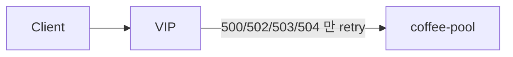

# 2.40 HTTP Retry — codes

## 구성



## 적용

```bash
kubectl apply -f gw-http-route.yaml
```

명령은 VIP `40.30.20.20` 에 터널로 도달하는 클라이언트에서 실행합니다.

## 클라이언트 검증

### 1. 정상

```bash
curl -sS -D - -o /tmp/gw-body  --resolve coffee.f5bnk.com:80:40.30.20.20 http://coffee.f5bnk.com/; echo; echo '--- body ---'; cat /tmp/gw-body; echo
```

**기대 응답**
- HTTP/1.1 200
- Body: `COFFEE SERVER - 30.0.0.10`

### 2. 선택 코드만 재시도

```bash
echo '백엔드가 503이면 재시도, 404면 재시도 없음. 중복 codes는 API 거부'
```

**기대 응답**
- 500/502/503/504 재시도
- 그 외 코드는 즉시 반환
- codes 중복 시 스키마 거부

## 정리

```bash
kubectl delete -f gw-http-route.yaml
```
