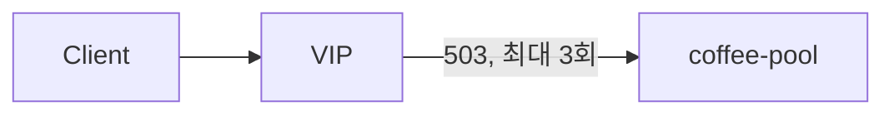

# 2.41 HTTP Retry — attempts

## 구성



## 적용

```bash
kubectl apply -f gw-http-route.yaml
```

명령은 VIP `40.30.20.20` 에 터널로 도달하는 클라이언트에서 실행합니다.

## 클라이언트 검증

### 1. 정상

```bash
curl -sS -D - -o /tmp/gw-body  --resolve coffee.f5bnk.com:80:40.30.20.20 http://coffee.f5bnk.com/; echo; echo '--- body ---'; cat /tmp/gw-body; echo
```

**기대 응답**
- HTTP/1.1 200

### 2. attempts=3

```bash
echo '계속 503이면 호출 수 <= 1+3. attempts=0 은 스키마 거부'
```

**기대 응답**
- 최대 3번 재시도
- attempts=0 은 거부 (v1.6 validation >= 1)

## 정리

```bash
kubectl delete -f gw-http-route.yaml
```
