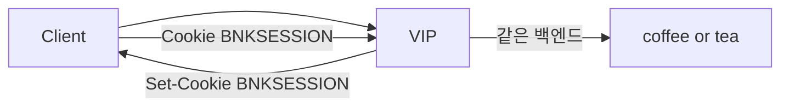

# 2.41 Session Persistence — Cookie

## 구성



## 적용

```bash
kubectl apply -f gw-http-route.yaml
```

명령은 VIP `40.30.20.20` 에 터널로 도달하는 클라이언트에서 실행합니다.

## 클라이언트 검증

### 1. 첫 요청 — 쿠키 발급

```bash
curl -sS -D - -o /tmp/gw-body -c /tmp/gw-cookie -H 'Host: coffee.f5bnk.com' http://40.30.20.20/
echo; echo '--- cookies ---'; cat /tmp/gw-cookie
```

**기대 응답**
- HTTP/1.1 200
- Body는 `COFFEE SERVER - 30.0.0.10` 또는 `TEA SERVER - 30.0.0.11`
- Set-Cookie / 쿠키 파일에 `BNKSESSION`

### 2. 같은 쿠키로 고정

```bash
for i in $(seq 1 10); do
  curl -sS -b /tmp/gw-cookie -H 'Host: coffee.f5bnk.com' http://40.30.20.20/
  echo
done | sort | uniq -c
```

**기대 응답**
- 10번 모두 같은 백엔드 body. coffee/tea가 섞이면 persistence 실패

## 정리

```bash
kubectl delete -f gw-http-route.yaml
```
