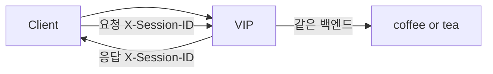

# 2.42 Session Persistence — Header

## 구성



## 적용

```bash
kubectl apply -f gw-http-route.yaml
```

명령은 VIP `40.30.20.20` 에 터널로 도달하는 클라이언트에서 실행합니다.

## 클라이언트 검증

### 1. 세션 헤더 확인

```bash
curl -sS -D - -o /tmp/gw-body  -H 'Host: coffee.f5bnk.com' http://40.30.20.20/; echo; echo '--- body ---'; cat /tmp/gw-body; echo
```

**기대 응답**
- HTTP/1.1 200
- 응답에 `X-Session-ID` (구현이 헤더를 내려주는 경우)

### 2. 같은 헤더로 고정

```bash
SID=$(curl -sS -D - -o /tmp/gw-body -H 'Host: coffee.f5bnk.com' http://40.30.20.20/ | awk -F': ' 'tolower($1)=="x-session-id"{print $2}' | tr -d '\r')
echo "SID=$SID"
for i in $(seq 1 10); do
  curl -sS -H 'Host: coffee.f5bnk.com' -H "X-Session-ID: $SID" http://40.30.20.20/
  echo
done | sort | uniq -c
```

**기대 응답**
- 동일 `X-Session-ID` 로 10회가 한 백엔드로만 가야 함

## 정리

```bash
kubectl delete -f gw-http-route.yaml
```
