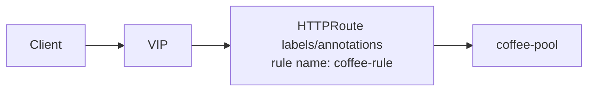

# 2.43 HTTPRoute Meta

## 구성



## 적용

```bash
kubectl apply -f gw-http-route.yaml
```

명령은 VIP `40.30.20.20` 에 터널로 도달하는 클라이언트에서 실행합니다.

## 클라이언트 검증

### 1. 트래픽

```bash
curl --resolve coffee.f5bnk.com:80:40.30.20.20 http://coffee.f5bnk.com/
```

**기대 응답**
- HTTP/1.1 200
- Body: `COFFEE SERVER - 30.0.0.10`

### 2. 메타/status

```bash
kubectl get httproute httproute-meta -n web -o yaml | sed -n '1,40p; /status:/,$p' | head -80
```

**기대 응답**
- labels `poc=httproute-meta`, `test-id=2.43`
- annotations `poc.f5bnk.com/test-id=2.43`
- Accepted=True, ResolvedRefs=True
- rule name `coffee-rule`

## 정리

```bash
kubectl delete -f gw-http-route.yaml
```
