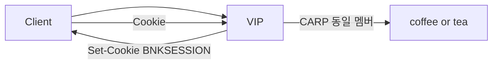

# 2.43 Session Persistence — type Cookie

네이티브 `sessionPersistence` Cookie 미적용.  
iRule v2 `persist carp`. persist 테이블/DSSM 없이 Cookie 값을 해시해서 같은 멤버.  
coffee+tea 를 한 Pool 에 둠. 쿠키 값은 `coffee`/`tea` 가 아니라 해시 키.



## 적용

```bash
kubectl apply -f gw-http-route_iRule-v2.yaml
```

curl 은 VIP `40.30.20.20` 터널 클라이언트. TMM 카운터는 클러스터.

## 클라이언트 검증

### 1. 쿠키 발급 + body

```bash
curl -sS -D - -o /tmp/gw-body -c /tmp/gw-cookie \
  --resolve coffee.f5bnk.com:80:40.30.20.20 http://coffee.f5bnk.com/
echo; echo '--- body ---'; cat /tmp/gw-body; echo
cat /tmp/gw-cookie
```

**기대 응답**
- HTTP/1.1 200
- Body: `COFFEE SERVER - 30.0.0.10` 또는 `TEA SERVER - 30.0.0.11` (CARP 해시, 둘 중 하나)
- Set-Cookie / 쿠키 파일에 `BNKSESSION`

이 body 를 2·3번 비교 기준으로 둔다.

### 2. 같은 쿠키 50회

```bash
for i in $(seq 1 50); do
  curl -sS --no-keepalive -b /tmp/gw-cookie \
    --resolve coffee.f5bnk.com:80:40.30.20.20 http://coffee.f5bnk.com/
  echo
done | sort | uniq -c
```

**기대 응답**
- 50회 모두 1번 body 와 같음

### 3. 두 TMM 모두 수신

앞단 L4 ECMP 가 TMM `172.24.0.10` / `172.24.0.11` 로 나눈다. `--no-keepalive` 면 요청마다 소스 포트가 달라져 양쪽 TMM 에 들어간다. CARP 는 persist DB 가 없어서 어느 TMM 이든 같은 쿠키 → 같은 멤버.

클러스터에서 카운터를 찍고, 클라이언트로 2번을 다시 친 뒤 다시 찍는다.

```bash
for pod in $(kubectl get pod -n f5-bnk-instance -l app=f5-tmm \
  -o jsonpath='{.items[*].metadata.name}'); do
  echo "=== $pod ==="
  kubectl exec -n f5-bnk-instance "$pod" -c debug -- \
    tmctl -d blade virtual_server_stat -s name,clientside.tot_conns
done
```

**기대**
- 두 TMM 파드 모두 `tot_conns` 증가
- client body 는 계속 1번과 같음

## 정리

```bash
kubectl delete -f gw-http-route_iRule-v2.yaml
```

## 네이티브 / iRule v1

`gw-http-route.yaml` 은 native Cookie persist. 미적용.  
`gw-http-route_iRule.yaml` 은 Cookie 값으로 `pool` 고정. persist DB/CARP 아님.  
v2 와 같이 apply 하지 않는다.
