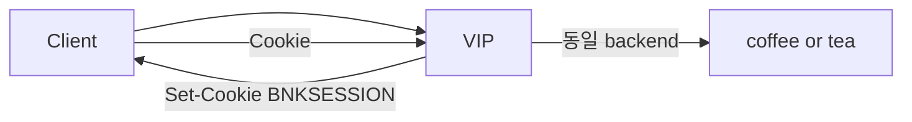

# 2.43 Session Persistence — type Cookie

## 구성



## 적용

```bash
kubectl apply -f gw-http-route.yaml
```

명령은 VIP `40.30.20.20` 에 터널로 도달하는 클라이언트에서 실행합니다.

## 클라이언트 검증

### 1. 쿠키 발급

```bash
curl -sS -D - -o /tmp/gw-body -c /tmp/gw-cookie \
  --resolve coffee.f5bnk.com:80:40.30.20.20 http://coffee.f5bnk.com/
cat /tmp/gw-cookie
```

**기대 응답**
- Set-Cookie / 쿠키 파일에 `BNKSESSION`
- absoluteTimeout 3600s

### 2. 50회 고정

```bash
for i in $(seq 1 50); do
  curl -sS -b /tmp/gw-cookie --resolve coffee.f5bnk.com:80:40.30.20.20 http://coffee.f5bnk.com/
  echo
done | sort | uniq -c
```

**기대 응답**
- 50회 모두 같은 백엔드 body

## 정리

```bash
kubectl delete -f gw-http-route.yaml
```
