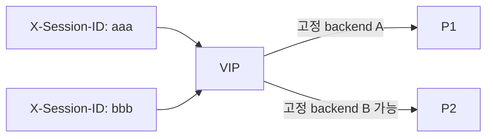

# 2.44 Session Persistence — type Header

## 구성



## 적용

```bash
kubectl apply -f gw-http-route.yaml
```

명령은 VIP `40.30.20.20` 에 터널로 도달하는 클라이언트에서 실행합니다.

## 클라이언트 검증

### 1. 동일 헤더 고정

```bash
for i in $(seq 1 20); do
  curl -sS -H 'X-Session-ID: aaa' --resolve coffee.f5bnk.com:80:40.30.20.20 http://coffee.f5bnk.com/
  echo
done | sort | uniq -c
```

**기대 응답**
- 20회 모두 같은 백엔드

### 2. 다른 헤더 값은 독립 분산

```bash
curl -sS -H 'X-Session-ID: aaa' --resolve coffee.f5bnk.com:80:40.30.20.20 http://coffee.f5bnk.com/; echo
curl -sS -H 'X-Session-ID: bbb' --resolve coffee.f5bnk.com:80:40.30.20.20 http://coffee.f5bnk.com/; echo
```

**기대 응답**
- aaa와 bbb는 서로 다른 세션. 각각은 자기 백엔드에 고정

## 정리

```bash
kubectl delete -f gw-http-route.yaml
```
