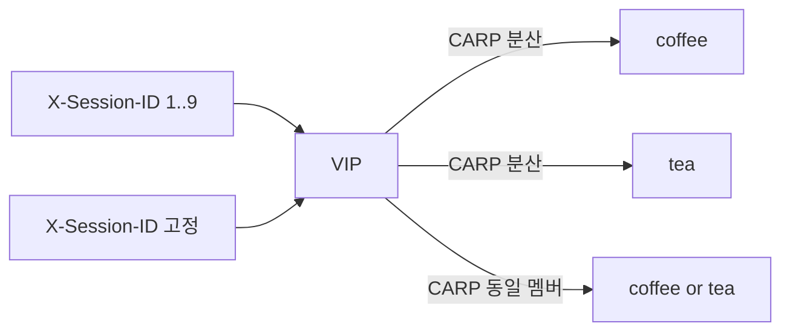

# 2.44 Session Persistence — type Header

네이티브 `sessionPersistence` Header 미적용.  
iRule v2 `persist carp`. persist 테이블/DSSM 없이 `X-Session-ID` 값을 해시해서 같은 멤버.  
coffee+tea 를 한 Pool 에 둠.



## 적용

```bash
kubectl apply -f gw-http-route_iRule-v2.yaml
```

curl 은 VIP `40.30.20.20` 터널 클라이언트. TMM 카운터는 클러스터.

## 클라이언트 검증

### 1. 헤더 값 1–9 — 멤버 분산

마지막 `X-Session-ID` 값만 바꾼다. CARP 해시가 두 멤버로 갈린다.

```bash
for i in $(seq 1 9); do
  curl -sS --no-keepalive -H "X-Session-ID: $i" \
    --resolve coffee.f5bnk.com:80:40.30.20.20 http://coffee.f5bnk.com/
  echo
done | sort | uniq -c
```

**기대 응답**
- `COFFEE SERVER - 30.0.0.10` / `TEA SERVER - 30.0.0.11` 둘 다
- 대략 고르게 (한쪽만 9회면 실패)

### 2. 한 값 20회 — 고정

```bash
for i in $(seq 1 20); do
  curl -sS --no-keepalive -H 'X-Session-ID: 1' \
    --resolve coffee.f5bnk.com:80:40.30.20.20 http://coffee.f5bnk.com/
  echo
done | sort | uniq -c
```

**기대 응답**
- 20회 모두 같은 body (1번에서 `1` 이 간 멤버)

### 3. 두 TMM 모두 수신

앞단 L4 ECMP 가 TMM `172.24.0.10` / `172.24.0.11` 로 나눈다. `--no-keepalive` 면 요청마다 소스 포트가 달라져 양쪽 TMM 에 들어간다. CARP 는 persist DB 가 없어서 어느 TMM 이든 같은 `X-Session-ID` → 같은 멤버.

클러스터에서 카운터를 찍고, 클라이언트로 2번을 다시 친 뒤 다시 찍는다.

```bash
for pod in $(kubectl get pod -n f5-bnk-instance -l app=f5-tmm \
  -o jsonpath='{.items[*].metadata.name}'); do
  echo "=== $pod ==="
  kubectl exec -n f5-bnk-instance "$pod" -c debug -- \
    tmctl -d blade virtual_server_stat -s name,clientside.tot_conns
done
```

**기대**
- 두 TMM 파드 모두 `tot_conns` 증가
- client body 는 계속 2번과 같음

## 정리

```bash
kubectl delete -f gw-http-route_iRule-v2.yaml
```

## 네이티브

`gw-http-route-f1.yaml` 은 native Header persist. 미적용. v2 와 같이 apply 하지 않는다.
