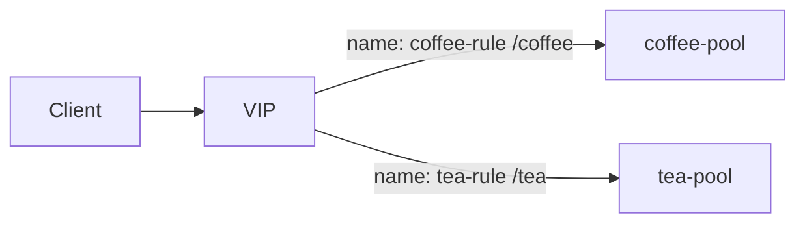

# 2.45 HTTP Route Rule — rules[].name

## 구성



## 적용

```bash
kubectl apply -f gw-http-route.yaml
```

명령은 VIP `40.30.20.20` 에 터널로 도달하는 클라이언트에서 실행합니다.

## 클라이언트 검증

### 1. rule 별 전달

```bash
curl -sS -D - -o /tmp/gw-body  --resolve coffee.f5bnk.com:80:40.30.20.20 http://coffee.f5bnk.com/coffee; echo; echo '--- body ---'; cat /tmp/gw-body; echo
```

**기대 응답**
- HTTP/1.1 200
- Body: `COFFEE SERVER - 30.0.0.10`

### 2. 다른 rule name

```bash
curl -sS -D - -o /tmp/gw-body  --resolve coffee.f5bnk.com:80:40.30.20.20 http://coffee.f5bnk.com/tea; echo; echo '--- body ---'; cat /tmp/gw-body; echo
```

**기대 응답**
- HTTP/1.1 200
- Body: `TEA SERVER - 30.0.0.11`

### 3. name 식별

```bash
kubectl get httproute httproute-rule-name -n web -o yaml | grep -A2 'name: coffee-rule'
```

**기대 응답**
- rules[].name 이 `coffee-rule`, `tea-rule`
- 같은 Route에 name 중복이면 스키마 거부

## 정리

```bash
kubectl delete -f gw-http-route.yaml
```
