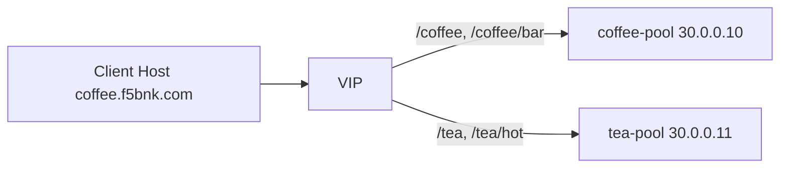

# 2.4 HTTPRoute Match — path PathPrefix

## 구성



## 적용

```bash
kubectl apply -f gw-http-route.yaml
```

명령은 VIP `40.30.20.20` 에 터널로 도달하는 클라이언트에서 실행합니다.

## 클라이언트 검증

### 1. prefix /coffee

```bash
curl --resolve coffee.f5bnk.com:80:40.30.20.20 http://coffee.f5bnk.com/coffee
```

**기대 응답**
- HTTP/1.1 200
- Body: `COFFEE SERVER - 30.0.0.10`

### 2. 하위 경로도 prefix 매칭

```bash
curl --resolve coffee.f5bnk.com:80:40.30.20.20 http://coffee.f5bnk.com/coffee/bar
```

**기대 응답**
- HTTP/1.1 200
- Body: `COFFEE SERVER - 30.0.0.10`

### 3. prefix /tea

```bash
curl --resolve coffee.f5bnk.com:80:40.30.20.20 http://coffee.f5bnk.com/tea/hot
```

**기대 응답**
- HTTP/1.1 200
- Body: `TEA SERVER - 30.0.0.11`

### 4. 다른 prefix

```bash
curl --resolve coffee.f5bnk.com:80:40.30.20.20 http://coffee.f5bnk.com/other
```

**기대 응답**
- HTTP/1.1 404

## 정리

```bash
kubectl delete -f gw-http-route.yaml
```
