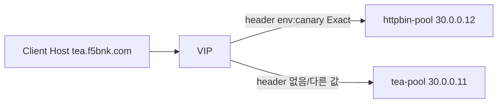

# 2.6 HTTPRoute Match — headers Exact

## 구성



## 적용

```bash
kubectl apply -f gw-http-route.yaml
```

명령은 VIP `40.30.20.20` 에 터널로 도달하는 클라이언트에서 실행합니다.

## 클라이언트 검증

### 1. Exact 헤더 매칭

```bash
curl --resolve tea.f5bnk.com:80:40.30.20.20 -H 'env: canary' http://tea.f5bnk.com/
```

**기대 응답**
- HTTP/1.1 200
- Body: `HTTPBIN CANARY SERVER - 30.0.0.12`

### 2. 헤더 없음

```bash
curl --resolve tea.f5bnk.com:80:40.30.20.20 http://tea.f5bnk.com/
```

**기대 응답**
- HTTP/1.1 200
- Body: `TEA SERVER - 30.0.0.11`

### 3. 값 불일치

```bash
curl --resolve tea.f5bnk.com:80:40.30.20.20 -H 'env: prod' http://tea.f5bnk.com/
```

**기대 응답**
- HTTP/1.1 200
- Body: `TEA SERVER - 30.0.0.11`

## 정리

```bash
kubectl delete -f gw-http-route.yaml
```
