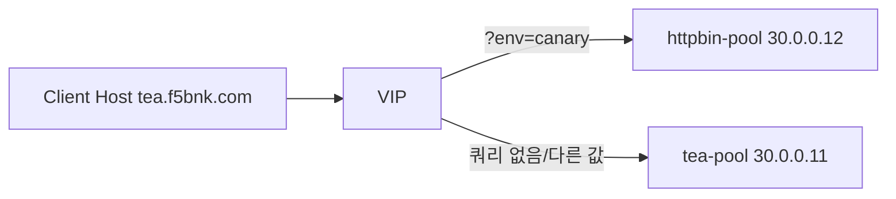

# 2.8 HTTPRoute Match — queryParams Exact

## 구성



## 적용

```bash
kubectl apply -f gw-http-route.yaml
```

명령은 VIP `40.30.20.20` 에 터널로 도달하는 클라이언트에서 실행합니다.

## 클라이언트 검증

### 1. Exact 쿼리

```bash
curl -sS -D - -o /tmp/gw-body  -H 'Host: tea.f5bnk.com' http://40.30.20.20/?env=canary; echo; echo '--- body ---'; cat /tmp/gw-body; echo
```

**기대 응답**
- HTTP/1.1 200
- Body: `HTTPBIN CANARY SERVER - 30.0.0.12`

### 2. 쿼리 없음

```bash
curl -sS -D - -o /tmp/gw-body  -H 'Host: tea.f5bnk.com' http://40.30.20.20/; echo; echo '--- body ---'; cat /tmp/gw-body; echo
```

**기대 응답**
- HTTP/1.1 200
- Body: `TEA SERVER - 30.0.0.11`

### 3. 값 불일치

```bash
curl -sS -D - -o /tmp/gw-body  -H 'Host: tea.f5bnk.com' http://40.30.20.20/?env=prod; echo; echo '--- body ---'; cat /tmp/gw-body; echo
```

**기대 응답**
- HTTP/1.1 200
- Body: `TEA SERVER - 30.0.0.11`

## 정리

```bash
kubectl delete -f gw-http-route.yaml
```
