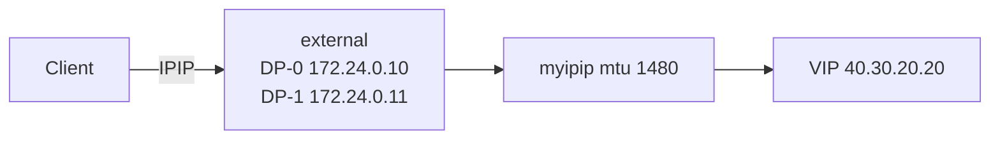

# 2609_f5bnk

F5 BNK Gateway API PoC. HTTP/gRPC/TCP/UDP 테스트 YAML은 `HTTP_Routing/`, `Advanced_Feature/` 를 봅니다.

VIP `40.30.20.20` 으로 들어가려면 TMM에 IPIP tunnel이 있어야 합니다. 수정하는 것은 **ConfigMap** 과 **DaemonSet 이미지** 두 개입니다.

---

# TMM IPIP Tunnel

## 구성



| 항목 | 값 |
|---|---|
| Namespace | `f5-bnk-instance` |
| ConfigMap | `tmm-init` → `data.user_conf.tcl` |
| DaemonSet | `f5-tmm` → container `f5-tmm` image |
| Tunnel | `myipip` |
| DP-0 | `local_ip 172.24.0.10` |
| DP-1 | `local_ip 172.24.0.11` |
| MTU | `1480` |
| 이미지 | `repo.f5.com/images/tmm-img:v10.203.3` |

`tmm_init.tcl` 은 수정하지 않습니다. tunnel 설정은 `user_conf.tcl` 에만 넣습니다.

---

## 적용

### 1. ConfigMap — `user_conf.tcl`

```bash
kubectl get cm tmm-init -n f5-bnk-instance -o yaml
```

`data.user_conf.tcl` 을 아래 내용으로 맞춥니다.

```tcl
puts "tmm_device_name = [tmm_device_name]"
bigdb connection.autolasthop disable
switch [tmm_device_name] {
  "DP-0" {
    puts "this is DP-0"
    ipip_tunnel "myipip" {
      mtu 1480
      local_ip 172.24.0.10
    }
  }
  "DP-1" {
    puts "this is DP-1"
    ipip_tunnel "myipip" {
      mtu 1480
      local_ip 172.24.0.11
    }
  }
}
```

한 줄 patch:

```bash
kubectl patch cm tmm-init -n f5-bnk-instance --type merge -p '{"data":{"user_conf.tcl":"puts \"tmm_device_name = [tmm_device_name]\"\nbigdb connection.autolasthop disable\nswitch [tmm_device_name] {\n  \"DP-0\" {\n    puts \"this is DP-0\"\n    ipip_tunnel \"myipip\" {\n      mtu 1480\n      local_ip 172.24.0.10\n    }\n  }\n  \"DP-1\" {\n    puts \"this is DP-1\"\n    ipip_tunnel \"myipip\" {\n      mtu 1480\n      local_ip 172.24.0.11\n    }\n  }\n}\n"}}'
```

또는 `kubectl edit cm tmm-init -n f5-bnk-instance` 로 같은 내용을 넣습니다.

### 2. DaemonSet — TMM 이미지

```bash
kubectl edit daemonset f5-tmm -n f5-bnk-instance
```

container `f5-tmm` 의 image 를 바꿉니다.

```yaml
image: repo.f5.com/images/tmm-img:v10.203.3
```

`postStart` 는 이미 있으면 그대로 둡니다. 추가하지 않습니다.

```yaml
lifecycle:
  postStart:
    exec:
      command:
      - /opt/bin/core_helper_init.sh
```

이미지 변경 후 TMM 파드가 재시작됩니다. Ready 될 때까지 기다립니다.

```bash
kubectl get pods -n f5-bnk-instance -l app=f5-tmm -o wide
kubectl get ds f5-tmm -n f5-bnk-instance -o jsonpath='{.spec.template.spec.containers[?(@.name=="f5-tmm")].image}{"\n"}'
```

---

## 검증

파드 이름은 `kubectl get pods` 결과로 바꿉니다.

### 1. TMM 로그

```bash
kubectl logs -n f5-bnk-instance f5-tmm-6h6gx -c f5-tmm | grep -E 'this is DP|IPIP tunnel'
```

기대:

```text
this is DP-0
IPIP tunnel myipip is created
```

다른 파드는 `this is DP-1`.

### 2. debug 에서 인터페이스

```bash
kubectl exec -n f5-bnk-instance f5-tmm-6h6gx -c debug -- ip -br a
```

기대: `myipip` 가 목록에 있음. IPv4가 없고 `fe80::` 만 있어도 됩니다.

```text
external         UNKNOWN        172.24.0.10/24 ...
myipip           UNKNOWN        fe80::.../64
```

두 파드 모두 `myipip` 가 보여야 합니다.

### 3. 클라이언트

```bash
curl -sS -D - -H 'Host: coffee.f5bnk.com' http://40.30.20.20/
```
